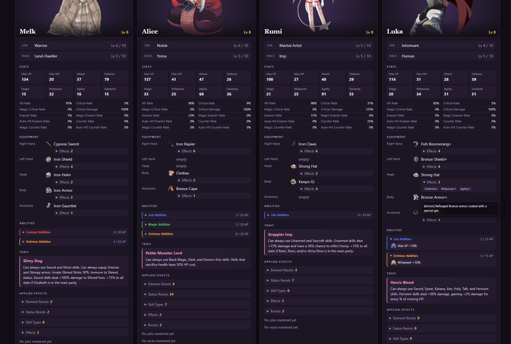

# Party Sheet

Press **P** anywhere in the game to write a party sheet into the `Party sheets` folder of the game folder: a card for every party member, split into the Frontline and the Reserve, with play time, gold and location on top. Open it in any browser.

Each save gets its own sheet, named after the save you last loaded or saved to: `05_party_sheet.html` for save 5, `autosave01_party_sheet.html` after loading the autosave, `unsaved_party_sheet.html` for a new game you haven't saved yet. Writing the sheet again replaces that save's sheet.

## On each card

- **Picture** from the Library, with name and level.
- **Job and race** with their levels; a star marks a mastered one.
- **Stats**, Max HP, MP and SP included, with large numbers shortened the way the game's status screen does, like `12.346Mil.`. Hover a stat for its exact value.
- **Equipment**, with the icons of the gems in each item's sockets next to its name.
- **Abilities** equipped, per category in the colours of their icons in the ability screen, with the AP they use. Proof Abilities show up once you have them.
- **Trait** with its description.

Hover an item, gem or ability for the game's description of it.

Longer lists fold away and open with a click:

- the effects of each item, and its gems with their effects
- each ability category
- **Applied Effects**: the element and status resists, usable skill types, effects and boosts everything on the character adds up to. Effects and boosts are sorted into categories like Strikes, SP, Defense or Element. Effects from several sources are combined the way the game combines them in battle (added up, multiplied, the highest counting, or chances combined) and marked with ∑; hover them for the calculation.
- the jobs and races mastered, sorted by rank like the job change screen, from Basic to Forbidden

The images are inside the page, so it can be moved or shared on its own. A few seconds after writing it, Edge or Chrome converts the portraits to WebP in the background, which takes the page from about 8 MB to about 2 MB for a full party.

## Frontline image

P also writes an image next to the page, like `05_party_sheet.png`: the Frontline's cards side by side, without the folded lists. It fits Discord well, where images show right in the chat.

The image is taken by Microsoft Edge, or Google Chrome if Edge is missing, which runs in the background without a window. The game doesn't wait for it; the image appears a few seconds later.

## Character image

Press **P** while a character's status screen is open to write an image of that character alone, like `05_party_sheet_Alice.png` next to the other files. It holds everything the page shows of her, with no lists folded away:

- her picture with her stats below it, her job and race, and her trait
- her equipment with each item's effects and gems written out
- her abilities
- her element and status resists, and every job and race of the highest rank she has levels in, like her Forbidden Jobs, mastered or not, with her level in each
- her Proof Abilities in columns across the whole width
- her skill types, effects and boosts across the whole width, effects and boosts showing only the value everything adds up to. Weapon boosts sit in a box per weapon they need, like *Dagger Equipped* holding *Sword Booster 150%*.

Like the Frontline image, it is taken by Edge or Chrome in the background and appears a few seconds later.

## Mod Config Menu

With the Mod Config Menu installed, the options are there, otherwise at the end of the game's Config menu:

- **[Party Sheet] Output**: write the page and the image, only the page, or only the image.
- **Write Party Sheet**: writes it right away, like the hotkey.
- **[Party Sheet] Hotkey**: the key that writes the sheet anywhere in the game, **P** by default. In Mod Config Remake 1.3.0 or later, confirm it and press the new key; the menu refuses the game's own keys and keys another mod's option already has. In other menus, pick among the letters the game leaves free (P, O, I, U, K, L, M, N, J, H, G), Tab, Insert, Home, End, or **None** to write it only with the button. While another mod takes typed text, such as a chat, the hotkey does nothing.
- **[Party Sheet] Theme**: the colours of the page and the image.
  - **Dynamic** (default): white and gold if you chose Ilias, dark and purple if you chose Alice. Before you choose, it stays dark.
  - **Static**: always the same colours, the ones picked under **`-> Shown Theme`**: **Alice (Dark)** (default) or **Ilias (Light)**.

## Install

1. Install the community's mod loader: the `Patch.rb` from [*Patch.rb (enable Type 1 mods)*](https://mgq.miraheze.org/wiki/Paradox_mods#Patch.rb_(enable_Type_1_mods)) on the MGQ wiki, in your `Patch` folder. If you already use other Patch folder mods, you have it.
2. [Download `Party_Sheet.rb`](https://github.com/Pauliinchen/MGQ-Paradox-Mod-Collection/releases/latest/download/Party_Sheet.rb) and put it into the `Patch` folder.

To uninstall, delete `Patch\Party_Sheet.rb`, and the `Party sheets` folder in the game folder if you like.

## Settings

These are constants at the top of `Party_Sheet.rb`. Open it in any text editor to change them.

- `ENABLED`: turns the mod off without uninstalling it.
- `EMBED_IMAGES`: set to `false` for a much smaller page that loads its images from the game folder instead. It then only works while it stays in the `Party sheets` folder.
- `PORTRAIT_QUALITY`: the WebP quality of the portraits, from 0 to 1, `0.85` by default. Set it to `nil` to keep the game's PNGs.

If something is missing from the page or no image appears, `Party Sheet.log` in the game folder says why.

## Compatibility

Tested on 3.06 with and without the English translation. Without it, the sheet shows the game's Japanese names and descriptions. It also works in game folders with Japanese names.

The pictures need the game's graphics as loose files in its `Graphics` folder. With the graphics still packed in `Game.rgss3a`, the cards show the character's face instead.

The mod replaces no game methods. It runs alongside these, leaving what they do unchanged:

- `DataManager.save_game_without_rescue`, `DataManager.load_game_without_rescue` and `DataManager.setup_new_game`, to name the sheet after the save
- `Scene_Base#update_basic`
- `Scene_Config#start`
- `Window_Config#refresh` and the Mod Config Menu's `Window_ModConfig#refresh`, to show Shown Theme only while Theme is Static
